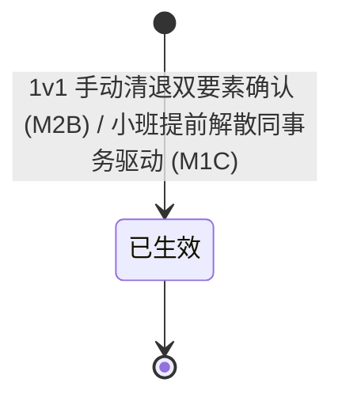
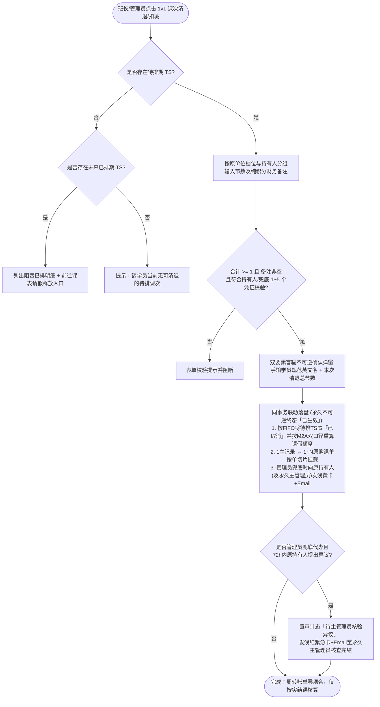

/** (c) 2024-2026 Topee (https://topee.top). All rights reserved. Proprietary and confidential. */

# 产品需求文档 (PRD) — 子模块 2B：课次清退与财务备注 (Credit Deduction & Refund Notes)

| 文档属性 | 内容 |
| :--- | :--- |
| **文档版本** | v2.0（精简重构版） |
| **所属模块** | 模块二：订单与资金流转 (Orders & Payments) |
| **关联子模块** | [m2a_course_orders.md](./m2a_course_orders.md)（购课单与 TS 资产）｜ [m1a_student_profile.md](./m1a_student_profile.md)（学员档案资产卡）｜ [m5a_transfer_collection.md](./m5a_transfer_collection.md)（周转账单） |
| **创建与更新日期** | 2026-11-05（创建） / 2026-11-13（精简重构为「课次清退/扣减 + 财务备注」） / 2026-11-19（支持单次多价位联合清退） / 2026-11-21（对齐动态关联，打通 M1C 小班提前解散伴生清退记录） / 2026-11-22（红队封板与 SSOT 归口收口：明确纯积分口径禁用人民币/元、学员手动清退仅限 1v1、按价位含备课费分组 FIFO 作废与实付积分逐节求和、小班改绑按原资金持有人逐节标注、确立课次清退记录唯一实体归口与跨实体联动清单，清零英文枚举并同步 M2A `§4.5` 指针） / 2026-11-23（**策略红队全面收口 `D1-B / D2-B / D3–D6 / L-1–L-6`**：① `D1-B/L-4` 维持「已生效」永久不可逆单一终态，将二次确认升级为**手输学员规范英文名 + 清退总节数**双要素盲输强校验并明示无法 0 积分补录；② `D2-B` 保留管理员紧急兜底即时生效，升级向原资金持有人〔及普通管理员代办时同步向「永久主管理员」〕派发 **M4 浅黄提醒卡 + Email**，并开放原持有人 `72h` 内【提出异议复核】直达「永久主管理员」浅红紧急卡 + Email 审计；③ `D3-A` 对齐 M2A 正交分离的`原价位档位`分组 FIFO 与`单节实付积分快照`逐节求和及改价/尾差提示；④ `D4–D6` 确立 M2B 为小班解散核销唯一公式 SSOT、`1 主清退记录 ↔ 1～N 原购课单`按单切片挂载，并对齐 `JPG / PNG / PDF ≤ 10MB` 凭证标准；⑤ 补全 `L-1–L-5` 拦截明细引导、划转持有人标注、M2A `AC-2A-09` 双口径额度重算与注销清零指引） / 2026-11-23（**协同 M4 红队 D2 收口**：明确 1v1 清退触发的 M4 站内提醒随主事务同事务原子落盘、关键 Email 于主事务提交成功后异步投递） |

---

## 1. 概述与执行摘要 (Executive Summary)
课次清退与财务备注子模块（`m2b`）面向班长与平台管理员，解决学员停课退费或小班提前结课解散时的剩余未上课时核销问题。全平台退费与结转严格统一按**纯积分**核算（默认 1:1 业务认知，全模块不出现“人民币”、“元”或币种符号），少儿教务退费由收款方（班长/主理人或管理员）在线下微信直接向家长核算退还，不设复杂审批流、违约金公式及线上周转账冲抵；本模块作为**课次清退记录的唯一归口 (SSOT)**，统一沉淀两类来源的永久只读核销凭据：① **本模块主动触发的 1v1 手动【课次清退/扣减】**（仅限 1v1 待排期 TS，维持「已生效」永久不可逆终态并以提交前双要素盲输防呆与 `72h` 兜底异议监督闭环）；② **由 [M1C 小班提前结课解散](./m1c_classes.md#L214) 同事务单向驱动的伴生清退记录**（唯一定义小班核销待上交积分公式及按原持有人拆列口径，对家长端不可见）。当前阶段：MVP 正式功能迭代。

---

## 2. 问题定义与背景 (Problem Statement)
- **低频退款与线下协商现实**：少儿英语培训中途退费极少，且 100% 为班长/校长与家长在微信协商后线下直接结清退还。
- **重审批与固定公式摩擦**：此前设计的电商级退款单、10% 阶梯违约金自动计算及 M5A 违约金追缴冲抵流转过重，且与线下实际协商金额经常不一致，反而增加了对账负担。

---

## 3. 目标用户与角色画像 (Users & Personas)

### 3.1 角色一：班长 / 平台管理员（经办人）
- **核心诉求**：在线下与家长结清退费后，在系统里快速把该学员剩余 1v1 待排课时扣减掉，并留下一句清晰的纯积分财务备注。
- **预期成果**：几秒内完成课次核销，防止家长继续约课；同时周转账单只按实际已结课计算应交积分，账目清爽。

### 3.2 角色二：出资家长（只读查看方）
- **核心诉求**：在购课记录或资产变动列表中能看到课次被核销的节数、退款实付积分与经办备注，确认账目一致（小班解散清退记录对家长端物理不可见）。

---

## 4. 核心业务流程 (Main Flows)

### 4.1 1v1 学员课次手动清退/扣减主流程 (Happy Path · 仅限 1v1)
1. **发起入口（严格仅限 1v1 课次）**：班长或管理员打开学员综合档案的【课次资产与排课总览】，或打开对应已付款 1v1 购课单，点击 **【课次清退/扣减】**（小班待排 TS 无学员归属，不出现在学员资产卡入口，小班退课唯一路径为 [M1C 提前结课解散](./m1c_classes.md#L214)）。
2. **分组输入与纯积分实时测算**：
   - 系统严格按**「原价位档位（区分含/不含额外备课费 `+10积分`）+ 资金持有人」**分组展示该学员当前可清退的 **1v1 剩余待排期课次数量**（对齐 [M2A AC-2A-16](./m2a_course_orders.md#L275) 正交双字段口径：同原价位档位下正常购课单与强提改价单统一合并分组，含通过 M2A 同家庭划转流入该学员名下的待排 TS，如 `16积分（不含备课费）：剩余 4 节未排`、`16积分（含备课费 +10）：剩余 2 节未排`）；
   - **含强提改价/尾差与跨持有人划转课次明示**：若某分组内混有特批强提改价或尾差节次（即存在 `单节实付积分快照 ≠ 原档位含备课费单价`），该分组行显式标注提示 `含特批改价/尾差节次，按先购先扣实付快照逐节求和`；若某分组资金持有人非当前操作班长（含同家庭划转流入的他方持有课次），分组行置灰并高亮提示 **`[资金由 持有人姓名 持有 · 须由原持有人或平台管理员操作清退]`**（管理员可通过兜底流程解锁）；
   - 操作人可在**同一次清退中同时为多个本人可清退分组分别输入清退节数** $n_i$（各组 $0 \le n_i \le \text{该组剩余待排节数}$，且总清退节数 $\sum n_i \ge 1$），或点击一键 **`[ 全部清零 ]`** 自动填满**当前操作人有权清退**的全部剩余待排 1v1 分组（班长仅填满本人持有分组，管理员按兜底规则填满全部分组）；
   - **FIFO 预览与逐节快照求和**：系统在同一「原价位档位 + 备课费标记 + 资金持有人」分组内按 TS 生成时间先后（**FIFO**）预先锁定拟作废的 TS（正常单与强提单按时间顺序统一出列），界面实时汇总展示**本次清退总节数**、**清退后剩余未排节数**、各涉及原购课单占用节数切片及**`1v1 退款实付积分`**（严格按拟作废 TS 自身固化的**`单节实付积分快照`**逐节求和，自然吸收 `+10` 额外备课费及强提折后尾差；**全界面与全字段统一使用“积分”，严禁显示“人民币”、“元”或币种符号**）；操作人须必填**财务备注**（1–200 字，例如：`线下退费微信转账 160 积分，家长因移居停课`）；持有人本人操作时线下转账凭证选填（最多 5 个），管理员越级代班长兜底清退时必填 1～5 个凭证（`JPG / PNG / PDF`，单文件 $\le 10\text{MB}$）。
3. **前置防呆校验与阻塞明细引导**：
   - 若该学员名下**无任何待排期 TS 且无未来已排期 TS**，禁止发起并友好提示“该学员当前无可清退的待排课次”；
   - 若该学员名下仍存在**未来「已排期」1v1 课次**（无论当前待排池是否足够本次扣减），严禁跳过 M3B 按师归口权限及 `<3h` 出勤异常追溯擅自强删已排课格；阻断面板直接列出当前阻塞的未来已排期明细（**上课日期时段、授课老师规范名/姓名、老师所属负责班长**）并附 `[ 前往课表请假释放 ]` 快捷跳转，提示协调对应负责班长或由管理员在课表请假退回待排期池后再行清退。
4. **双要素强确认落盘与跨实体同事务联动清单**：
   - **双要素盲输不可逆强确认**：点击提交后，弹窗完整列出本次拟作废总节数、各分组及涉及原购课单扣减明细、合计 `1v1 退款实付积分` 与财务备注，并显著警示 **`“课次清退一经确认永久不可撤销（且购课单仅支持正整数实收，无法 0 积分重开补回），请务必确认已完成线下微信沟通与核算”`**；操作人须手动准确输入 **`学员规范英文名`** 及 **`本次清退总节数`**（双要素完全匹配且若为管理员兜底已上传 1～5 个有效凭证）方可激活确认；
   - 确认后，系统在同一事务内原子完成本实体落盘（写入终态「已生效」课次清退记录）并执行以下 **跨实体联动**（任一步失败则整体回滚；关联 M4 站内提醒随主事务同事务原子落盘，关键 Email 于主事务提交成功后异步投递）：
     1. **驱动 [TS 全局规则 (`BUSINESS_RULES §3.2`)](../BUSINESS_RULES.md#L103) 与 M2A 额度重算**：按各分组 FIFO 将对应的 $N$ 节「待排期」1v1 TS 置为不可逆终态「已取消」，同步按 [M2A `AC-2A-09`](./m2a_course_orders.md#L256) 双维度重算可用请假参考额度（同时重算扣减原购课单详情页本单剩余有效 TS 参考额度，及 M1A 双方/该学员最新实际持有有效 1v1 总 TS 聚合参考额度）；
     2. **驱动 [M2A 购课单](./m2a_course_orders.md#L136)（`1 主清退记录 ↔ 1～N 原购课单` 按单切片挂载）**：一次跨分组或 FIFO 跨单清退仅生成 **1 笔「课次清退记录」** 作为全量核销唯一主实体；原「已付款」购课单**主状态恒定保持「已付款」不变**（列表轻标 `含清退`），每张被本次清退命中的原购课单详情页仅只读挂载**本单自身被扣减 TS 节数与实付积分切片**以精确展示本单“原始 / 本单已清退 / 本单剩余”对账汇总条（若跨多单联合清退，同步标注`属跨单联合清退：总计 M 节 / P 积分，其中本单占 m 节 / p 积分`并附链接直达 M2B 清退记录全量明细）；
     3. **写入资产流水与触发 M4 分级告警/异议监督**：同步写入 [M1A 学员综合档案](./m1a_student_profile.md) 资产变动流水；若属平台管理员替班长兜底代清退，通过 [M4](./m4_notification.md) 向**原资金持有人班长**派发 **浅黄提醒卡 + Email**，且若操作人为非 [M0A](./m0a_auth_and_account.md) 唯一**「永久主管理员」**的普通管理员，**同步向「永久主管理员」派发浅黄提醒卡 + Email** 审计留痕；在职原持有人班长可在落盘后 **`72 小时`** 内对凭证或线下核算提出异议复核（详见 `AC-2B-05 #2`）。

### 4.2 小班提前结课解散伴生清退流程（M1C 单向驱动 · 唯一公式 SSOT）
- **触发边界与单写方声明**：小班待排与未来已排 TS 的作废清退**唯一入口为 [M1C 小班提前结课解散](./m1c_classes.md#L214)**（主理人/管理员无需也不允许在 M2B 手动新建小班清退单）。当 M1C 执行【提前结课解散】且存在至少 1 节被作废的已付款未上课 TS 时，由 M1C 在同一事务内**单向驱动本模块生成 1 笔生效「课次清退记录」（小班解散清退记录）**；弹窗前置拦截、原因枚举、免责勾选与日历释放逻辑均归口 M1C，本模块不重复定义。
- **小班解散积分核销唯一公式（SSOT）、改绑资金拆列与跨单切片挂载**：
  - 本模块作为小班解散核销积分计算与拆列口径的**唯一归口**：落盘固化关联小班与当前主理人、来源标签（`小班解散-退费` 或 `小班解散-结转新班`）、作废总节数（拆明未来已排 + 待排池）、**`小班核销待上交积分`**（严格按全部被作废的已付款未上小班 TS 自身固化的**单节待上交积分快照精确求和**，**与 1v1 家长实付退费积分语义严格隔离**，仅供核销主理人免交积分与财务核对）、解散原因与 1–200 字解散备注、以及**逐节按原 TS 资金持有人归属拆列明细**（若该小班曾在 M1B 改绑过主理人且名下同时存在原主理人收款与新主理人收款的未上 TS，当前主理人可一并解散，但清退记录内必须按各节 TS 原锁定资金持有人分别标注归属节数与核销积分）；
  - **跨多张小班购课单按单切片（`1 主清退记录 ↔ 1～N 原已付款小班单`）**：若作废的未上 TS 跨越多张「已付款」小班购课单，全量明细唯一沉淀于本笔 M2B 解散清退记录，各关联小班购课单详情页仅只读挂载**本单被作废 TS 节数与待上交积分切片**（并标注所属联合解散清退单链接，防止重复加总）。
  - 小班解散清退记录对家长端 100% 物理不可见，且不上传额外截图凭证。

### 4.3 课次清退记录专属实体生命周期、字段锁定与留存规则 (Entity & Log SSOT)
> **【实体生命周期与日志唯一归口声明】**：**课次清退记录**（1v1 手动清退与小班解散伴生清退）的状态枚举、触发入边、字段不可变规则、兜底代办异议核验态、审计留痕与数据留存策略 100% 统一且唯一由本 PRD 管辖与定义；其余文档只做单向引用。

```mermaid
stateDiagram-v2
    [*] --> 已生效: 1v1 手动清退双要素确认 (M2B) / 小班提前解散同事务驱动 (M1C)
    已生效 --> [*]
```

| 当前状态 | 目标状态 | 触发事件 / 动作 | 触发方 / 驱动源 | 前置条件 | 本实体落盘与留痕规则 |
| :--- | :--- | :--- | :--- | :--- | :--- |
| **`[*]`** | **已生效** *(唯一永久终态)* | ① 1v1 手动清退确认； ② 小班提前结课解散伴生 | ① 本模块（资金持有人班长 / 管理员兜底）； ② **宿主入边**：[M1C 提前结课解散](./m1c_classes.md#L214) | ① 总清退节数 $\ge 1$、填 1–200 字备注、通过手输`规范英文名 + 总节数`强校验（管理员兜底须传 1–5 个 `≤10MB` `JPG/PNG/PDF` 凭证）； ② M1C 解散存在 $\ge 1$ 节已付款未上 TS | 单事务创建不可篡改记录；固化逐节被作废 TS 明细、`1 ↔ N` 关联原购课单切片映射、原资金持有人归属、积分合计（`1v1 退款实付积分` 或 `小班核销待上交积分`）、操作人、时间、备注与凭证快照 |

- **全字段永久只读与绝对不可逆规则（无冲正/作废分支）**：清退记录一经落盘即进入唯一终态「已生效」，**全部核心业务与财务字段（清退节数、积分合计、被作废 TS、财务备注与已传凭证）永久只读锁死，不设撤销、冲正回退、改积分或删改备注通道**，已置为「已取消」的 TS 保持永久终态；依靠提交前**手输学员规范英文名与清退总节数**双要素强校验从源头防范误操作。
- **管理员兜底代清退外置异议审计态（不回改核心字段与 TS 状态）**：仅针对管理员越级代班长兜底清退的 1v1 记录，允许原持有人班长在 **`72 小时`** 内补充发起一次只读审计异议标识（`无异议` → **`待主管理员核验异议`** → 由「永久主管理员」线下核对凭证后标为 **`已核验完结`**）；该审计流转仅作监督追责与线下核账闭环记录，**严禁回写修改主记录财务数值或恢复已作废 TS**。
- **留痕边界与数据留存策略**：本记录本身即为永久只读财务核销审计凭据（一经生效核心台账永不改写，仅兜底异议追加只读异议说明与核验结论记录），**长期只读审计留存、严禁物理删除**（不随学员删档/归档、家长注销或小班归档/解散级联抹除）；与 [M5A 周转账单](./m5a_transfer_collection.md) 及 [M5B 老师周课酬单](./m5b_weekly_settlement.md) 保持物理零耦合（已清退作废 TS 绝不计入周度转账与发薪）。

---

## 5. 用户故事 (User Stories)
- **US-2B-01（快速课次清退）**：作为一个班长，我想要在线下微信退费给家长后，直接在学员资产卡上输入清退节数和纯积分退款备注完成扣减，以便于快速锁定剩余课次不再被预约。
- **US-2B-02（一键全部清零注销前置清扫）**：作为一个班长，当学员彻底停课退学并申请注销/归档档案时，我想要一键填满并清零本人名下托管的剩余 1v1 待排课时，同时清楚了解仍需配合清理的未来已排期、在途单或他方托管待排课次步骤，以便于顺利引导学员通过 [M1A](./m1a_student_profile.md) 五项资产清零校验。
- **US-2B-03（备注与实付积分留痕追溯）**：作为一个平台管理员，我想要在购课单详情页和清退台账中查看每一笔课次清退的操作人、逐节快照合计的退款实付积分、原资金持有人及财务备注，以便于核对历史退课账目。
- **US-2B-04（与周转账单解耦）**：作为一个班长，我期望退费不产生额外的违约金追缴单或冲抵计算，每周只需按实际已上完的课次上交积分，以便于避免线下协商口径与系统公式打架。

---

## 6. 验收标准清单 (Acceptance Criteria)

### 6.1 课次清退校验及扣减
- **AC-2B-01（仅限 1v1、`原价位档位`正交分组、FIFO 统一出列与划转标注校验）**：学员资产卡发起的手动清退**严格仅限 1v1「待排期」TS**（包含通过 M2A 同家庭划转流入该孩子名下的待排 1v1 TS，不混入小班 TS）；界面严格按**「`原价位档位`（继承自 M2A `AC-2A-16` 字典档位，区分含/不含额外备课费 `+10积分`）+ 资金持有人」**分组展示当前可用待排节数（同原价位下正常单与强提改价单合并归组；混有强提改价或尾差 TS 的分组须显式标示`含特批改价/尾差节次，按先购先扣实付快照逐节求和`；含同家庭划转流入且持有人非当前操作班长的分组置灰标示`资金由 [持有人姓名] 持有 · 须由原持有人或平台管理员操作清退`）。支持单次为多个分组同时录入清退节数 $n_i$（非负整数且不超过该组可用待排节数，合计 $\sum n_i \ge 1$，录入 `0` 节的分组自动忽略）。同一分组内严格按 TS 生成时间先购先扣（FIFO）顺序统一作废；界面实时汇总展示各组及总计的**当前剩余未排节数**、**退后剩余未排节数**、各原购课单预计扣减节数切片与 **`1v1 退款实付积分`**（按本次被作废 TS 自身固化的**`单节实付积分快照`**逐节求和）。超限或总数为 0 时阻断并明确提示。
- **AC-2B-02（已排期明细引导与空资产前置拦截）**：若学员名下**仍存在未来「已排期」1v1 课次**（无论当前待排期池是否足够本次扣减），严禁跳过 M3B 按师归口与 `<3h` 出勤异常追溯直接作废已排课格；阻断界面须明确列出阻塞中的**未来已排期课次清单（上课日期时段、授课老师、老师所属负责班长）**及 `[ 前往课表请假释放 ]` 快捷跳转，提示协调负责班长或由管理员在课表请假释放回待排期池后再清退；若学员既无待排也无未来已排课次，阻断并提示“该学员当前无可清退的待排课次”。
- **AC-2B-03（财务备注必填与纯积分口径约束）**：执行手动清退必须填写 1–200 字的财务备注（记录退费原因与线下结清情况），未填写禁止提交；**全界面、表单占位符与报表统一仅展示“积分”，严禁显示“人民币”、“元”或 `¥` 符号**。
- **AC-2B-04（双要素盲输强确认、跨实体原子联动与 `1 ↔ N` 切片挂载）**：
  1. **不可逆双要素强校验（提交前）**：二次确认弹窗须完整汇总拟清退总节数、分组与涉及原购课单扣减明细、合计 `1v1 退款实付积分` 与备注，明示警示`“操作永久不可撤销，且购课单仅支持正整数实收，无法 0 积分重开补回”`，操作人**必须手动输入准确的「学员规范英文名」及「本次清退总节数」**方可确认提交；
  2. **1v1 手动清退（原子落盘）**：确认后同事务驱动 TS 置为永久终态「已取消」，同步按 M2A `AC-2A-09` 双口径重算请假参考额度（同时重算扣减原购课单剩余有效 TS 参考额度及 M1A 学员当前最新持有有效 1v1 总 TS 聚合参考额度），写入唯一终态「已生效」`课次清退记录`；**`1 笔清退记录 ↔ 1～N 张原购课单`**：全量明细唯一归口于本笔 M2B 清退记录，关联的 1～N 张「已付款」购课单**主状态始终保持「已付款」不变**，各单详情仅只读挂载**本单被扣减 TS 切片汇总条与明细**（跨多单联合清退时同步标明`属跨单联合清退`并附跳转原清退记录链接），并同步写入 M1A 资产明细；
  3. **M1C 小班提前解散伴生清退（唯一公式 SSOT · 宿主入边）**：仅由 [M1C【提前结课解散】](./m1c_classes.md#L214) 同事务单向触发落盘，来源标为 `小班解散-退费` 或 `小班解散-结转新班`；按被作废已付款未上 TS 的单节待上交积分快照精确求和作为唯一公式计算 **`小班核销待上交积分`**（与 1v1 退款实付积分语义严格区分），并**逐节按被作废 TS 原锁定资金持有人拆列归属**（即使小班在 M1B 改绑过主理人，历史 TS 归属亦不随改绑迁移）；若跨越多张已付款小班购课单，遵循相同的 `1 主清退记录 ↔ N 原小班购课单` 按单切片只读挂载，原小班单主状态保持「已付款」不变，对家长端物理不可见。

### 6.2 权限与结算边界
- **AC-2B-05（资金持有人强校验、管理员兜底双告警与 `72h` 异议复核）**：
  1. **持有人本人操作**：仅该笔待排期 TS 的**当前资金持有人（对应的收款班长，或资金由平台持有时的平台管理员）**可直接执行 1v1 手动清退；非持有人的其他班长物理禁止操作，系统阻断并提示“该课次资金当前由 [持有人姓名] 持有（含同家庭划入课次），请由资金持有人或平台管理员操作清退”。小班解散触发则由当前接手主理人（或管理员）在 M1C 发起，但清退记录归属仍按原 TS 持有人标注。
  2. **管理员紧急兜底代清退与 `72h` 异议审计闭环**：当资金持有人为某班长时，平台管理员保留紧急兜底代清退权限，但**必须强制上传 1～5 个 `JPG / PNG / PDF` 线下转账凭证（单文件 $\le 10\text{MB}$）**并填写原因且通过双要素盲输确认，未上传凭证禁止提交；落盘后通过 [M4](./m4_notification.md) 向**原资金持有人班长**派发 **浅黄提醒卡 + Email**（若经办管理员为非 [M0A](./m0a_auth_and_account.md) 唯一「永久主管理员」的普通管理员，**同步向「永久主管理员」派发浅黄提醒卡 + Email**）。**在职原持有人班长可在落盘后 `72 小时` 内在记录详情点击 `[ 提出异议复核 ]` 填写 `1–200 字` 异议说明**，立即将审计异议态置为`待主管理员核验异议`并向**「永久主管理员」**派发 **M4 浅红紧急卡 + Email**（由「永久主管理员」核对凭证并线下核账后标为`已核验完结`；该审计闭环严格不修改已生效主记录数值，也不恢复已作废 TS）。家长与老师端无操作入口，家长仅可只读查看 1v1 清退节数、退款实付积分与备注记录。
- **AC-2B-06（周结算零耦合）**：已清退作废的 TS 绝对不进入 `M5A` 周转账单和 `M5B` 老师周课酬单；系统不计算任何违约金拆分，周转账单严格按实际结课 TS 核算。

---

## 7. 本期范围外清单 (Out of Scope)
- **不支持线上原路自动资金退回**：所有资金退还均在线下微信/支付宝完成，系统仅做课次扣减与备注留痕。
- **不支持多级退款审批流与清退撤销/冲正**：取消提交→初审→终审→打款确认的多阶段状态机；清退记录一经双要素确认生效即永久不可撤销（兜底异议仅走「永久主管理员」只读凭证审计与线下追账，不回退系统 TS）。
- **不支持 10% 违约金自动拆分公式与 M5A/M5B 违约金冲抵**：停用违约金比例拆账与影子补偿结算。

---

## 8. 约束条件 (Constraints)
- **双要素盲输不可逆防呆**：提交 1v1 课次清退前，弹窗必须提示`“操作永久不可撤销（且购课单无法 0 积分补录重开），请确认已完成线下沟通与核算”`，并强制经办人**手动精准输入「学员规范英文名」与「本次清退总节数」**后方可执行。
- **凭证规格与必填限制（全财务单据统一标准）**：普通持有人本人清退时线下转账凭证为**选填**；**管理员代班长兜底清退时为必填（1～5 个）**。对齐 [M2A `AC-2A-20`](./m2a_course_orders.md#L289) 与 [M5A `AC-5A-12`](./m5a_transfer_collection.md#L234) 统一口径：单文件上限 **`10MB`**，支持 **`JPG / PNG / PDF`**。

---

## 9. UI/UX 界面线框说明 (Wireframe Level)
- **触发位置**：
  - **独立清退记录列表页**：由首页金刚位 `↩️ 课次清退` 或 Tab 3【教务中心】`↩️ 退款管理/课次清退` 进入（右上角常驻 **`[ + 发起课次清退 ]`** 快捷入口：班长视角选人弹窗**仅列出本人名下托管有待排 1v1 课次的学员**，管理员视角可搜全校有待排 1v1 课次学员，选定后直接呼出清退抽屉）；
  - **上下文内嵌入口**：学员综合档案【课次资产】区右上角 `[ 课时清退/扣减 ]` 文字链按钮，或 M2A 购课单详情页底部操作区。
- **课次清退记录列表页（排序、搜索与筛选规范）**：
  - **权限范围与记录呈现**：班长展示本人作为资金持有人（含改绑前收款的小班旧课次与他方兜底代办单）或本人经办的清退记录（含本人当前主理小班解散伴生的清退记录）；管理员展示全校全部 1v1 与小班清退记录；列表卡片同时支持展示**学员**（呈现`1v1 退款实付积分`；若处于`待主管理员核验异议`则醒目标注浅红异议徽标）与**小班**（首行展示 `🏫 [小班名称]` 与来源徽标 `小班解散-退费` / `小班解散-结转新班`，呈现`核销待上交积分`与各原持有人拆列）两类主体，**全页绝不展示任何人民币或元单位**；
  - **默认排序**：默认按**清退操作时间倒序**排列（最新一笔清退置顶；存在`待主管理员核验异议`单据时管理员视角可筛选优先处理）；
  - **搜索与筛选**：
    - **即时搜索框**：支持按**学员规范英文名（含前 1–2 字母）、小班名称、关联购课单号、或财务/解散备注关键词**即时检索（列表与抽屉对班长/管理员统一主显规范英文名、隐藏中文小名，家长端自家只读单据可辅显孩子小名）；
    - **轻量筛选**：时间范围（`近 30 天` / `近 90 天` / `全部`）；管理端额外提供 **`[ 全部持有人 ▾ ]`**（置顶 `[ ⭐ 我经办/直管 ]`）及清退类型筛选（`全部` / `1v1 手动清退` / `小班解散清退` / `管理员兜底代清退` / `待主管理员核验异议`）。
- **1v1 清退确认抽屉与前置拦截态**：
  - **前置阻塞展示（有未来已排课次时）**：展示阻塞明细清单（`MM-DD HH:mm · 老师 [规范名] · 负责班长 [姓名]`）与 `[ 前往课表请假释放 ]` 引导入口；
  - **顶部资产总览条与清零指引**：显式展示该学员当前**总剩余 1v1 未排课次**（如 `当前共剩余 6 节未排 (合计 113 积分)`）及一键快捷操作 **`[ 全部清零 ]`**（附轻量引导说明：`一键仅填满本人有权清退的待排 1v1 课次；若需办理档案注销/归档，仍需依序完成未来已排释放、在途单作废与他方托管课次清退`）；
  - **多分组明细输入行**：按**「原价位档位（区分含/不含额外备课费）+ 资金持有人」**逐行列出所有可清退 1v1 资产（如 `16积分（不含备课费）· 剩余 4 节未排`、`16积分（含备课费 +10）· 剩余 1 节未排`、`21积分（不含备课费）· 剩余 1 节未排`）；含强提改价/尾差 TS 时分组副行标明 `含特批改价/尾差节次，按先购先扣实付快照逐节求和`；每行右侧独立提供步进器/输入框录入本次清退节数（默认 `0`，提交时忽略 `0` 值），并实时标注退后余量（如 `退后余 2 节`）；非当前操作人持有的分组行置灰标注 **`资金由 [持有人姓名] 持有（含同家庭划入课次）· 须由原持有人或管理员操作`**（管理员可通过兜底流程解锁）；
  - **实时汇总条**：在输入框下方高亮汇总展示 **`本次清退：共 3 节 ｜ 退款实付积分：58 积分 ｜ 退后剩余未排：3 节`**（同步列明涉及原购课单扣减切片）；
  - 文本域：`财务备注`（占位提示：`例如：线下微信退费 160 积分，家长因故停课`）；
  - 持有人本人操作时：`选填 · 上传线下退款凭证（JPG/PNG/PDF，≤10MB，最多 5 个）`；管理员代班长兜底清退时：`必填 · 上传线下退款/转账凭证（1～5 个，JPG/PNG/PDF，≤10MB）`；
  - 底部按钮：`[ 取消 ]` + `[ 确认清退课时 ]`（点击后弹出**双要素盲输不可逆确认弹窗**：展示各组/各单明细并要求手动输入 `学员规范英文名` + `本次清退总节数` 方可最终提交）。
- **清退记录详情与内嵌历史展示**：
  - 管理员兜底代清退记录详情页在 `72h` 内对在职原持有人展示 **`[ 提出异议复核 ]`** 按钮；进入`待主管理员核验异议`后对「永久主管理员」展示异议说明、凭证大图与 **`[ 标为已核验完结 ]`** 审计按钮（只读留痕，不改数值）；
  - 在原「已付款」购课单详情与学员资产卡片底部按**操作时间倒序**展示只读切片记录：单单清退展示 `[2026-11-13] 清退 4 节（64 积分） · 经办人: Leo · 备注: 线下退费微信转账 64 积分`；跨多单联合清退在各购课单详情页标注 `[2026-11-13] 本单清退 2 节（32 积分）〔所属跨单联合清退共 5 节/90 积分 · 查看全单 →〕`。

---

## 10. 用户流程图 (User Flow Diagram)

```mermaid
flowchart TD
    Start([班长/管理员点击 1v1 课次清退/扣减]) --> HasAny{是否存在待排期 TS?}
    HasAny -- 否 --> HasSched{是否存在未来已排期 TS?}
    HasSched -- 是 --> TipRelease[列出阻塞已排明细 + 前往课表请假释放入口]
    HasSched -- 否 --> TipEmpty[提示：该学员当前无可清退的待排课次]
    HasAny -- 是 --> FillForm[按原价位档位与持有人分组输入节数及纯积分财务备注]
    FillForm --> Validate{合计 >= 1 且 备注非空\n且符合持有人/兜底 1~5 个凭证校验?}
    Validate -- 否 --> ErrTip[表单校验提示并阻断]
    Validate -- 是 --> DualConfirm[双要素盲输不可逆确认弹窗:\n手输学员规范英文名 + 本次清退总节数]
    DualConfirm --> Exec["同事务联动落盘 (永久不可逆终态「已生效」):\n1. 按FIFO将待排TS置「已取消」并按M2A双口径重算请假额度\n2. 1主记录 ↔ 1~N原购课单按单切片挂载\n3. 管理员兜底时向原持有人(及永久主管理员)发浅黄卡+Email"]
    Exec --> ProxyDispute{是否管理员兜底代办且\n72h内原持有人提出异议?}
    ProxyDispute -- 是 --> Appeal[置审计态「待主管理员核验异议」\n发浅红紧急卡+Email至永久主管理员核查完结]
    ProxyDispute -- 否 --> End([完成：周转账单零耦合，仅按实结课核算])
    Appeal --> End
```
