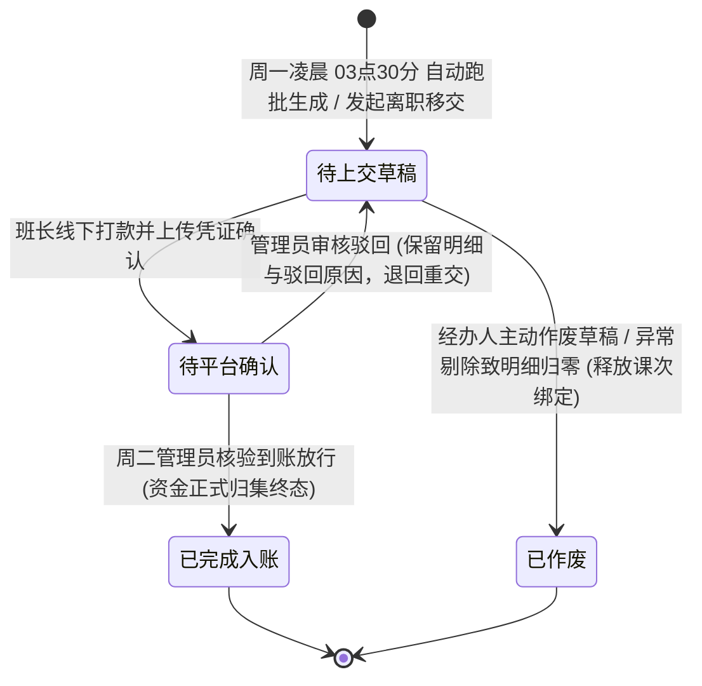
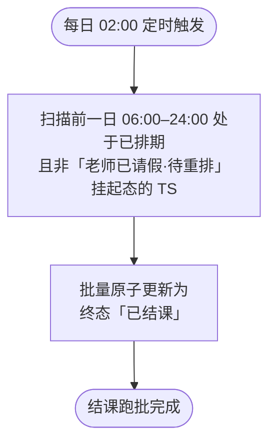
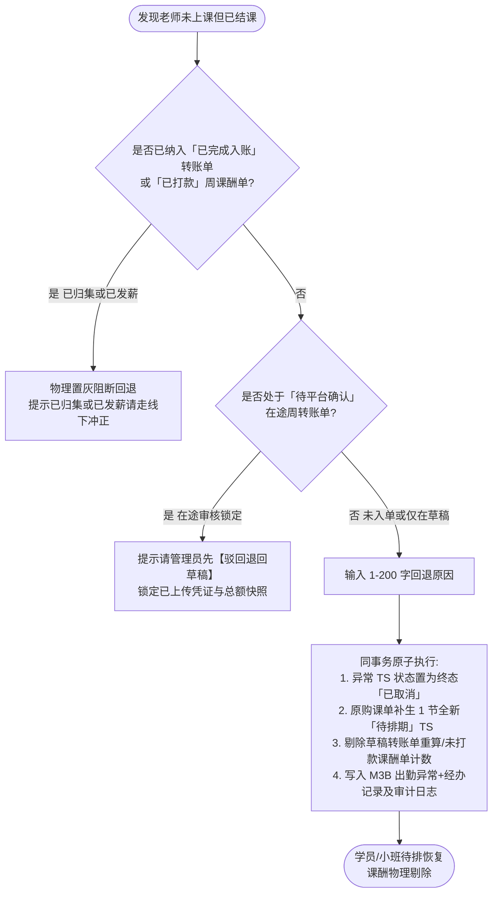
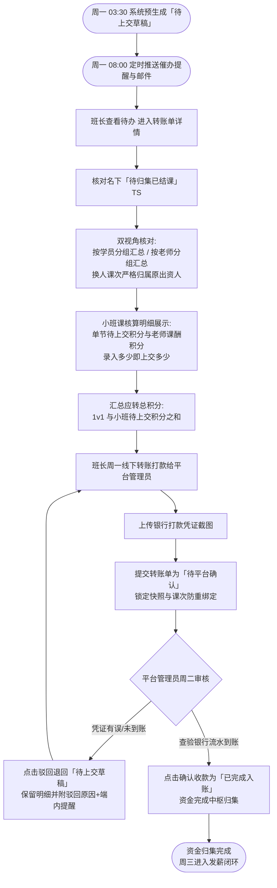
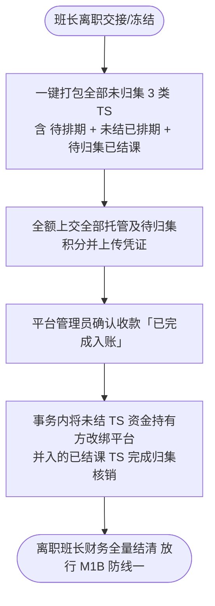

/** (c) 2024-2026 Topee (https://topee.top). All rights reserved. Proprietary and confidential. */

# 产品需求文档 (PRD) — 子模块 5A：结课跑批、异常回退与转账单归集 (Transfer & Capital Collection)

| 元数据项 | 说明 / 内容 |
|---|---|
| **模块代号** | `m5a` |
| **所属模块** | 模块五：周度财务对账与结算分账 (Weekly Settlement & Reconciliation) |
| **文档状态** | 待评审 (Draft) |
| **关联顶层 PRD** | [Prd-v5.md](../Prd-v5.md) |
| **关联规范文档** | [BUSINESS_RULES.md](../BUSINESS_RULES.md) |
| **关联模块划分** | [system_modules_overview.md](../system_modules_overview.md) |
| **创建与更新日期** | 2026-11-05 初稿；2026-11-10 增补已创建转账单全量双视角明细与审计对账标准；2026-11-12 对齐三种卡面；2026-11-12 无损脱水去重与系统守卫矩阵收敛；2026-11-22 班长离职移交包口径同步（一并打包未结 TS 与「待归集已结课」TS）；2026-11-22 **Red-Team 审查收口与双层实体/日志 SSOT 治理**：确立 TS 恒四态（`已结课` 为终态）、「已完成入账转账单 ∨ 已打款课酬单」双重冻结与在途审核单先驳回快照锁；补全周转账单 SSOT 四支柱与跨实体同事务联动清单；统一「价位」术语、纯积分口径与全量去技术化清理 |

---

## 1. 概述与执行摘要 (Executive Summary)

结课跑批、异常回退与转账单归集子模块（`m5a`）是 Dream 系统的资产结课与中央资金收口枢纽。本子模块负责在每日凌晨 02:00 将前一日正常结课的 TS 自动批处理流转为终态 **`已结课`**（TS 恒 4 态，不新增第 5 态；尚未纳入已完成入账周转账单的已结课课次在财务上统称为**「待归集已结课」**资产），提供“老师实际未上课但已被自动结课”的**异常未上课回退并自动补生待排 TS** 关键兜底保障，并驱动前端收款班长向中央平台发起**单向【转账单】（Transfer Order）**。系统严格贯彻**1v1 单节 TS 直接按购课单固化的价位积分快照（如 `16`/`18`/`21` 积分）直算、小班课按主理人录入的待上交积分全额归集（停用分成、工具费与自留/亏损贴补）**，并支持班长离职未结托管及待归集资产一键移交与资金持有人变更，确保散落于各班长手中的资金在周度发薪前安全归集至平台中央池。当前阶段：MVP 正式功能迭代。

---

## 2. 问题定义与背景 (Problem Statement)

- **痛点 1：跨日结课状态滞后导致财务核算基准不一**：若依赖人工逐节点击结课，极易产生遗漏或因班长作息不同导致账期割裂；次日凌晨统一跑批是保障日清周结的前提。
- **痛点 2：自动结课“误伤”未出勤课次引发课酬错发**：若老师实际旷课或因技术故障未上课，但系统到了次日凌晨依然自动将其置为结课，若无系统级冲退补生通道，将导致白白误发老师课酬且家长课次资产受损。
- **痛点 3：前端分散收款与中央统一发薪的对账断层**：资金由各班长在线下微信收取并托管，而老师课酬必须由平台管理员统一发放；若无严格的单向资金上交通道与凭证核验，极易产生班长挪用学费或平台垫资风险。
- **痛点 4：小班课多级分账易生理解歧义**：原先小班课若由系统在后台替班长扣除其他盈余与平台抽佣，班长容易对账面实收与应上交积分产生混淆；采用“录入多少就上交多少”并以单节正整数待上交积分为准，让小班对账回归最纯粹的透明状态。
- **痛点 5：班长离职引发托管资金烂尾风险**：班长离职时若名下仍有未消课次托管款或待归集已结课款，缺乏一键式的全量资产移交工具，会导致后续排课资金无主。
- **痛点 6：已创建转账单缺乏课次明细导致审批与事后对账死无对证**：若已创建转账单仅展示总额数字而丢失底层课次明细，管理员只能“盲审”打款截图，无法逐笔核验关联的学员与老师排课真实性；班长事后对账也缺乏详实凭据，严重违背财务存证与审计追溯红线。

---

## 3. 目标用户与角色画像 (Users & Personas)

### 3.1 角色一：负责班长（Leo）
- **角色定位**：前端收款托管方与资金上交人。
- **核心诉求**：每周发课酬前，在后台一键核对名下已结课 TS 打包生成的转账单；界面自动按学员和老师双视角对账；系统自动按小班 TS 待上交积分汇总算出准确的应上交总积分；线下转账打款并上传打款凭证截图。
- **预期成果**：账面清晰无糊涂账，录入多少就上交多少，应交平台的总积分分文不差。

### 3.2 角色二：平台管理员（Sarah）
- **角色定位**：中央资金归集人与财务总把关人。
- **核心诉求**：在管理员后台统一查验各班长提交的转账单及银行打款凭证，确认到账后一键审核通过；对异常未上课的课次能安全回退并自动补生待排期，确保发薪节数绝对准确。
- **预期成果**：全域资金 100% 颗粒归仓，发薪前资金到位。

### 3.3 角色三：离职班长（Tom）
- **角色定位**：离职交割人。
- **核心诉求**：离职交接时一键生成离职移交单，将名下所有未上完的课次资金全额转给平台，系统批量将资金持有人改绑为平台。
- **预期成果**：干干净净离职交割，后续教学与退费责任完全交接。

---

## 4. 核心业务流程 (Main Flows)

### 4.1 次日凌晨 02:00 自动结课批处理流
1. 每日服务器时间凌晨 02:00，系统自动触发每日结课批处理流程。
2. 系统检索前一自然日（`06:00–24:00` 营业期内）、当前处于「已排期」状态且**严格排除处于「老师已请假·待重排」挂起态**及已取消课次的全部 TS。
3. 批处理程序在同一事务内将这些 TS 的状态批量更新为终态 **`已结课`**。
4. 系统生成结课批次流水日志，记录本次结课的 TS 总数与时间戳。教务履约就此圆满达成，TS 恒为 4 态（`待排期 / 已排期 / 已结课 / 已取消`），不再承载后续财务状态；尚未随「已完成入账」周转账单归集的已结课课次在财务上统称为**「待归集已结课」**资产。

### 4.2 异常未上课回退补生待排 TS 流程
1. 老师实际未上课（如网络中断、老师旷工），但跨过次日凌晨已被系统自动置为「已结课」。
2. 班长或管理员在后台找到该节异常 TS，点击【异常未上课回退】。
3. 系统执行**双重财务冻结与在途审核单快照锁**校验：
   - **双重财务冻结阻断**：目标 TS 必须**尚未被纳入状态为「已完成入账」的周转账单，且尚未被纳入状态为「已打款」的 [M5B 老师周课酬单](./m5b_weekly_settlement.md)**（周三平台先行垫付发薪后同样物理冻结）；命中任一条件即物理置灰阻断回退，提示“已归集或已发薪，禁止回退”。
   - **在途待审单先驳回锁定**：若目标 TS 所关联的周转账单处于「待平台确认（审核中）」状态，为保证已上传打款凭证与总积分快照绝对一致，系统锁定并阻断直接回退，提示“该课次已随转账单提交审核，请管理员先【驳回退回草稿】后再执行回退”。
   - **可回退与联动剔除重算**：若该 TS 暂未进入任何转账单，或所关联的转账单仍处于「待上交草稿」态，允许执行回退；若有关联草稿单，系统自动从中剔除该 TS 并重算应上交总积分（剔除后若草稿明细归零，则自动将该草稿置为「已作废」）；同时从尚未标记「已打款」的 M5B 老师周课酬单中同步剔除该节计数。
4. 经办人强制输入异常回退原因（必填，1-200 字，如“老师网络故障缺席，与家长协商补课”）。
5. 系统在同一事务内原子执行：
   - 将该节异常 TS 状态由「已结课」更新为终态 **`已取消`**（物理从后续老师周课酬单核算中剔除）；
   - 系统定位该 TS 所属的原购课单，在原单下**自动补生 1 节全新的【待排期 TS】**（完全继承原单的资金持有方、原出资家长、原购课学员或小班归属及单节财务快照；其中 1v1 补归原学员，小班补回对应小班待排池且严禁关联个人学员档案）；
   - 同事务自动在 [M3B](./m3b_attendance_substitution.md) 写入 1 条**《出勤异常记录》**（异常大类：`异常未上课回退`，记在原授课老师名下）及 1 条**【经办记录】**（动作：`异常未上课回退补生`），并写入全链路操作审计日志（记录操作人、操作时间、原 TS 与补生 TS 关联及原因）。
6. 学员档案或小班待排池名下可用待排课次自动恢复 1 节，后续可正常重新约课或排课。

### 4.3 班长常规周度转账单归集流程 (周一转账日、周二核算日、周三发薪日)

> 架构全景流程图见 [10.3 班长向平台周度转账归集流](#103-班长向平台周度转账归集流-weekly-transfer-collection-flow)。

1. **每周一 03:30 系统自动跑批预生成【待上交草稿】转账单**：
   - 在凌晨 02:00 每日结课与 03:00 老师周课酬跑批完成后，系统自动触发班长转账草稿生成批处理；
   - 检索上周一至上周日营业期（每日 `06:00–24:00`）内授课（含周日营业期授课、周一凌晨 02:00 完成自动结课的课次，按原排课授课日期归属上一自然周）、由当前班长收款托管、当前状态为「已结课」且尚未被任何未作废转账单打包的「待归集已结课」TS；
   - **智能免打扰规则**：若该班长上周应上交总积分 $\le 0$（上周无课），系统不生成单据，不触发任何通知；
   - 若应上交总积分 $> 0$，系统在单一事务内自动创建周转账单（状态为「待上交草稿」），将这批 TS 绑定打包（依托课次唯一打包防重约束拦截任何重复打包），并预先算清：
     - ① 1v1 课次实付待上交总积分（**单节 TS 积分直接等于该 TS 对应价位的单节实付积分快照**，如 `16积分` / `18积分` / `21积分`，按购课单快照直取，不做任何旧版公式或额外折算）；
     - ② 小班课单节待上交积分之和（录入多少即上交多少）；
     - ③ 最终应上交平台总积分（① + ②）。
2. **每周一 08:00 定时催办提醒与待办透传**：
   - 每周一服务器时间 08:00，系统自动扫描名下存在「待上交草稿」转账单的班长；
   - 触发 M4 站内浅黄提醒卡与高优先级催办邮件：“尊敬的 [班长姓名]，您上一自然周的课次转账账单已出具，应上交总积分为 XX 积分。请于今日内完成线下打款并提交凭证”；
   - 班长登录工作台后，首页教务待办区域浮现 `待上交转账单 (1)`，点击秒级直达该预填账单。
3. **班长极简操作流（线下打款 + 上传凭证一键确认）**：
   - 班长打开草稿单，界面提供双视角核对（按学员分组、按老师分组）；
   - 界面清晰展示平台对公收款信息（银行开户行、账号、收款人或收款码）；
   - 班长在线下完成真实资金打款后，上传 1~5 张打款凭证截图，点击【确认已转账】；
   - 单据状态原子流转为「待平台确认」。
4. **周二核算日 (Tuesday Audit)**：
   - 平台管理员在后台集中查验各班长提交的转账单及银行打款流水；
   - 确认到账后点击【确认收款】，单据状态流转为终态「已完成入账」，表征资金正式颗粒归仓。底层 TS 主状态保持「已结课」不变，无需反向回写。
5. **周三发薪日与平台兜底策略 (Wednesday Payroll & Platform Fallback)**：
   - 平台管理员根据生成的【老师周课酬单】统一全额向授课老师发放薪酬，保障老师履约信心与教学稳定性；
   - **平台兜底发薪红线**：若个别班长周二前未完成资金转账上交，平台先行全额垫付发薪；未上交资金在管理后台标红预警，自动计入该班长对平台的应收款项（欠款），由财务线下微信群直接跟进催缴，严禁向老师转嫁班长拖欠风险。

### 4.4 班长离职全量待归集资产移交流程 (Resignation Handover)
1. 班长进入交接冻结期或准备离职交接，管理员在后台打开离职交接界面，或离职班长点击【离职资产移交】。
2. 系统一键检索并打包该班长名下**全部尚未向平台完成归集的 3 类课次资产**：① 全部「待排期」TS；② 全部未结课「已排期」TS；③ **全部尚未纳入已审结周度转账单的「待归集已结课」TS**（即状态为「已结课」且尚未随已完成入账周转账单归集的 TS；若名下尚存在未提交的「待上交草稿」，允许一并作废回流并合并入本离职移交单；若存在「待平台确认」审核中的周结单或名下为收款方的「待付款 / 续费预占 (HOLD)」在途购课/续费单，须先完结或作废清零）。
3. 系统核算上述 3 类课次应交总积分托管款，生成类型为「离职移交」的转账单（初始状态为「待上交草稿」）。
4. 离职班长将应移交托管款全额转账上交平台，上传打款凭证并提交审核。
5. 平台管理员核验银行流水到账后，点击【确认移交收款】。
6. 系统在同一事务内执行关键数据跃迁：
   - 转账单状态变更为终态「已完成入账」；
   - 批量将所涉及全部「待排期」与未结课「已排期」TS 的**资金持有方改绑为平台**；将本次一并打包的「待归集已结课」TS 正式完成归集核销（后续周一自动转账跑批不再重复抓取，历史单据保留原收款班长只读追溯）；
   - 离职班长与这批资金彻底结清解绑，后续由平台直接承担资金托管与周结发薪责任。

> **与 M1B 的衔接**：在 M5A 完成离职移交转账单与平台收款确认后，系统方解除该班长资金持有人身份；随后可在 M1B 中推进老师团队改绑与班长职务注销。

### 4.5 转账单作废与驳回分支
- **管理员审核驳回（退回「待上交草稿」重交）**：若班长打款数额与实转积分不符、未到账、凭证模糊或存疑，平台管理员在审核时点击【驳回转账单】并输入驳回原因（1-200 字）；转账单状态**直接退回「待上交草稿」**（保留原打包课次明细关联及驳回原因提示，并在 [M4](./m4_notification.md) 向班长推送端内浅黄提醒卡），班长补款/重传清晰凭证后可直接重新提交为「待平台确认」。
- **异常闭环兜底**：
  1. 若驳回原因涉及**单内某几节 TS 实际未上课**：管理员须先按上条将其驳回退回「待上交草稿」，随后班长或管理员在课格或异常大盘执行【异常未上课回退补生】，系统按 `AC-5A-05` 自动从该「待上交草稿」单中剔除该 TS 并重算应上交总积分；若剔除后单据内剩余 TS 为空（应交总积分 $\le 0$），系统自动将该单据置为「已作废」并释放占位，避免空单卡死；
  2. 若需要**整单放弃或重新打包**（如离职移交变动或重算范围）：班长或管理员可在「待上交草稿」状态下点击【作废草稿】，单据状态变为终态「已作废」，解除该单对这批课次的打包绑定关系，底层 TS 保持「已结课」不变并重新回到待打包池。

### 4.6 周转账单全生命周期、字段锁定、留痕与留存 SSOT 规则

> **【实体生命周期、修改规则、留痕与留存 SSOT 唯一归口声明】**：**周转账单**（含「周结上交」与「离职移交」两种单据类型）的生命周期状态机、字段可编/锁定规则、状态流转与操作留痕以及数据留存策略，100% 统一且唯一由本节管辖与维护。TS 课次全局状态机主定义在 [BUSINESS_RULES.md §3.2](../BUSINESS_RULES.md)，本模块跨实体驱动联动详见下方 [4.6.5 跨实体同事务联动清单](#465-跨实体同事务联动清单)。

#### 4.6.1 生命周期状态机与跃迁矩阵


```mermaid
stateDiagram-v2
    [*] --> 待上交草稿: 周一凌晨 03点30分 自动跑批生成 / 发起离职移交
    
    待上交草稿 --> 待平台确认: 班长线下打款并上传凭证确认
    待上交草稿 --> 已作废: 经办人主动作废草稿 / 异常剔除致明细归零 (释放课次绑定)
    
    待平台确认 --> 已完成入账: 周二管理员核验到账放行 (资金正式归集终态)
    待平台确认 --> 待上交草稿: 管理员审核驳回 (保留明细与驳回原因，退回重交)
    
    已完成入账 --> [*]
    已作废 --> [*]
```

| 当前状态 | 目标状态 | 触发事件 / 动作 | 操作人 / 驱动源 | 前置守卫条件与锁定规则 | 伴随副作用与资产流转 |
| :--- | :--- | :--- | :--- | :--- | :--- |
| **`[*]`** | `待上交草稿` | 周一转账草稿跑批 / 发起离职移交 | 系统自动 / 离职班长 / 管理员 | 上周待归集已结课 TS 应上交总积分 $> 0$；或离职班长名下有未归集托管或待归集已结课 TS | 创建周转账单主记录；绑定打包课次明细并受课次唯一防重约束拦截重复打包；周一 08:00 触发 M4 催办提醒；TS 主状态保持「已结课」不变 |
| `待上交草稿` | `待平台确认` | 班长线下打款并点击确认已转账 | 负责班长 / 离职班长 | 单据处于「待上交草稿」；打包明细非空；必须上传 1~5 张打款截图凭证 | 单据状态流转为「待平台确认」并**即刻锁定明细、总积分与凭证快照**；班长首页待办消红；进入管理员后台待审核列表 |
| `待上交草稿` | `已作废` | 经办人作废草稿单 / 异常剔除致明细归零 | 班长 / 管理员 / 系统自动 | 单据处于「待上交草稿」且尚未提交打款（人工操作须填原因）；或异常未上课回退剔除后明细为空 | 单据跃迁为终态「已作废」；解除这批课次的打包绑定，剩余有效已结课 TS 恢复为待打包状态 |
| `待平台确认` | `已完成入账` | 平台管理员核验银行流水确认到账 | 平台管理员 | 单据处于「待平台确认」；资金实际已到平台对公账户 | 单据跃迁为终态「已完成入账」；资金正式归集平台中枢；若是离职移交单，单内未结 TS 资金持有方原子改绑平台、并入的已结课 TS 完成归集核销；TS 主状态保持「已结课」零反向开销 |
| `待平台确认` | `待上交草稿` | 管理员审核驳回打款凭证或到账数额存疑 | 平台管理员 | 单据处于「待平台确认」；必须录入 1-200 字驳回原因 | 单据退回「待上交草稿」（保留原打包课次明细关联与最新驳回原因）；向班长派发 M4 站内浅黄提醒卡，解除锁定以支持重传凭证重交、异常回退剔除 TS 重算或主动作废 |

#### 4.6.2 字段可编与锁定规则矩阵
| 单据状态 | 可编辑 / 允许变更的业务内容 | 物理锁定 / 禁止变更的字段与操作 |
| :--- | :--- | :--- |
| **`待上交草稿`** | 上传/增删打款凭证截图（1~5 张）；经 [§4.2 异常未上课回退](#42-异常未上课回退补生待排-ts-流程) 自动剔除异常课次并同步重算打包节数与应上交总积分；执行【作废草稿】 | **严禁**人工直接篡改单节 TS 的积分快照或手工改写总积分；已打包课次受唯一防重约束，**严禁**被第二张有效转账单重复打包 |
| **`待平台确认`** | 仅管理员执行【确认收款】或【驳回转账单】（填入 1~200 字驳回原因） | **全部快照字段物理只读锁定**（打包课次明细、单节实付/待上交积分、应上交总积分、已上传打款凭证均不可增删改）；禁止在此态下对单内 TS 直接执行异常未上课回退（须先驳回退回草稿） |
| **`已完成入账`** | 无任何可编辑字段（永久归档终态） | 全字段、明细、打款凭证及状态流转历史**全平台永久只读锁定**；单内全部 TS 永久物理阻断异常未上课回退 |
| **`已作废`** | 无任何可编辑字段（永久归档终态） | 全字段与历史作废原因**永久只读锁定**；已解除的 TS 打包关联不可恢复原单 |

#### 4.6.3 流转与修改留痕规则（唯一归口定义）
1. **状态流转历史时间轴**：周转账单每次状态跃迁（含生成待上交草稿、提交待平台确认、审核驳回退回草稿、确认收款已完成入账、主动作废或归零作废）必须在同一事务内追加一条只读状态流转记录，明确记载原状态、目标状态、操作人/系统、流转时间与驳回/作废原因，并在【转账单详情页】按时间轴只读展示。
2. **草稿自动剔除与回退审计**：当草稿单因异常未上课回退自动剔除某节 TS 并重算总积分时，除在 M5A 记录系统操作审计日志外，联动生成 M3B《出勤异常记录》与【经办记录】（详见下方联动清单）。
3. **打款凭证不可篡改**：单据进入「待平台确认」及之后状态，所附打款凭证作为财务审计证据永久只读绑定于该单据快照。

#### 4.6.4 数据留存与清理策略
- **永久只读留存、严禁物理删除**：所有周转账单与离职移交转账单主记录（含「已完成入账」与「已作废」历史单据）、打包课次快照明细、打款凭证截图及状态流转历史，均属于核心财务合规凭证，与 [BUSINESS_RULES.md §3.2](../BUSINESS_RULES.md) 保持一致，**全生命周期永久只读留存，严禁任何角色物理删除或定时清理**；批处理结课跑批日志按系统常规审计周期归档留存。

#### 4.6.5 跨实体同事务联动清单
当 M5A 触发下列业务动作时，驱动本模块主实体与跨模块宿主实体在同一事务内保持最终一致（宿主实体各自状态机与字段规则详见对应唯一归口 PRD）：

| 触发动作 | 同事务驱动的外部 / 跨模块实体 | 结果方向与原子性说明 | 宿主归口 PRD |
| :--- | :--- | :--- | :--- |
| **每日 02:00 自动结课** | **课次 (`TS`)**、**批处理执行日志** | 将前一日 `06:00–24:00` 已排期且非「老师已请假·待重排」挂起态的 TS 原子置为终态「已结课」，并落盘批处理日志 | [BUSINESS_RULES.md §3.2](../BUSINESS_RULES.md) |
| **异常未上课回退补生** | **课次 (`TS`)**、**周转账单（草稿）**、**《出勤异常记录》**、**【经办记录】**、**老师周课酬单** | ① 原已结课 TS 置为终态「已取消」，并在原购课单补生 1 节「待排期」TS；② 从「待上交草稿」转账单剔除并重算（归零则自动作废）；③ 自动为原授课老师新增 1 条 `异常未上课回退` 出勤异常记录与 1 条 `异常未上课回退补生` 经办记录；④ 从未打款 M5B 老师周课酬单剔除该节计数（以上原子生效，任一失败全量回滚） | [BUSINESS_RULES.md §3.2](../BUSINESS_RULES.md)、[M3B](./m3b_attendance_substitution.md)、[M5B](./m5b_weekly_settlement.md) |
| **周一 08:00 催办 / 管理员驳回** | **站内提醒 (`Notification`)**、**催办邮件** | 周一 08:00 向存在草稿单的班长推送端内浅黄提醒卡与高优先级催办邮件；管理员驳回转账单时向对应班长推送端内浅黄提醒卡（驳回仅端内不发邮件） | [M4 消息与关键邮件](./m4_notification.md) |
| **离职移交单确认收款（已完成入账）** | **课次 (`TS`)**、**班长档案（离职防线一）** | 同一事务内将移交单中未结 TS 的资金持有方批量改绑为平台、核销并入的待归集已结课 TS，清零资金托管负债以放行 M1B 班长离职防线一 | [BUSINESS_RULES.md §3.2](../BUSINESS_RULES.md)、[M1B](./m1b_teacher_profile.md) |

---

## 5. 用户故事 (User Stories)

- **US-5A-01**：作为一个平台系统，我想要在每日凌晨 02:00 自动将正常结课的 TS 流转为已结课，以便于日清日结，为周度结算提供稳定数据基准。
- **US-5A-02**：作为一个负责班长，我想要在老师实际未上课时手动将已结课 TS 回退并自动补生 1 节待排期课次，以便于不扣除家长课次且不误发老师课酬。
- **US-5A-03**：作为一个负责班长，我想要在转账单界面按学员和按老师分组核对已结课明细，以便于对账一目了然、心服口服。
- **US-5A-04**：作为一个小班主理人，我想要系统直接按我开单录入的单节待上交积分快照全额归集（不额外扣除工具费或做复杂分成），以便于核对账目清清楚楚、录入多少即上交多少。
- **US-5A-05**：作为一个平台管理员，我想要在审核班长转账单时清晰查验银行打款凭证大图，以便于确认真金白银到账后才放行。
- **US-5A-06**：作为一个平台管理员，我想要在班长离职时一键移交所有未消课次资金并改绑资金持有人为平台，以便于杜绝离职坏账风险。
- **US-5A-07**：作为一个出资家长，我想要在课次更换实际上课学员后账单仍记在自己名下，以便于财课分离账目规范。
- **US-5A-08**：作为一个财务合规风控，我想要严格禁止班长与班长之间互相转账，以便于全平台资金流向完全透明呈星型归集。
- **US-5A-09**：作为一个负责班长或平台管理员，我期望在查阅任何已创建或历史归档的转账单详情时，均能随时调阅完整的双视角课次明细（按学员分组、按老师分组、小班核算明细），以便于在审批与历史对账时有据可查、双向穿透。

---

## 6. 验收标准清单 (Acceptance Criteria)

### 6.1 每日凌晨 02:00 自动结课跑批
- **AC-5A-01**：系统必须配置每日服务器时间 02:00 定时执行自动结课批处理。
- **AC-5A-02**：扫描目标严格限定为：上课日期等于前一日、处于 `06:00–24:00` 营业期内、当前状态为「已排期」且**严格排除处于「老师已请假·待重排」挂起态**的 TS。
- **AC-5A-03**：命中 TS 的状态必须批量原子变更为终态「已结课」（履约终态，不新增第 5 态），并记录批处理日志（批次号、处理条数、耗时）。

### 6.2 异常未上课回退补生兜底
- **AC-5A-04**：处于「已结课」状态的 TS 允许班长或管理员操作【异常未上课回退】；操作必须强制录入 1-200 字原因，空原因为非法请求。
- **AC-5A-05**：若目标 TS **已被纳入状态为「已完成入账」的周转账单，或已被纳入状态为「已打款」的 [M5B 老师周课酬单](./m5b_weekly_settlement.md)**，系统必须物理置灰阻断回退操作，并提示“已归集或已发薪，禁止回退”；若目标 TS 已被纳入处于「待平台确认（审核中）」的在途周转账单，系统锁定已提交总额与凭证快照并阻断直接回退，提示“请管理员先驳回退回草稿后再执行回退”；仅当未入任何转账单或所关联转账单处于「待上交草稿」时允许执行回退，并在同事务内自动从该草稿中剔除该 TS 且动态重算应上交总积分（若剔除后草稿明细为空、应交总积分 $\le 0$，则自动置为「已作废」并完结收口），同时从 M5B 未打款老师周课酬单中同步剔除该节计数。
- **AC-5A-06**：回退操作在同一事务内原子执行：
  - 原异常 TS 状态变更为终态「已取消」，物理从老师周课酬单统计中剔除；
  - **1v1 课次补生分支**：在原购课单下自动补生 1 节全新的「待排期」TS，其资金持有方、原出资家长、原学员及单节财务快照与原 TS 完全一致；
  - **小班课（1vN）补生分支**：在原小班购课单下自动向对应小班待排池退回补生 1 节连续双网格（50分钟）待排期 TS，**严禁关联任何个人学员档案**，由小班主理人后续在日历上重新补排；该取消课次不发老师课酬、不计入周转账上交；
  - **跨模块同事务留痕**：同事务自动写入 1 条 [M3B 《出勤异常记录》](./m3b_attendance_substitution.md#49-出勤异常记录唯一归口-ssot)（异常大类：`异常未上课回退`，记在原授课老师名下）、1 条 [M3B 【经办记录】](./m3b_attendance_substitution.md#410-经办记录唯一归口-ssot)（动作：`异常未上课回退补生`），并记录全链路系统操作审计日志。
- **AC-5A-06a（管理员后台全校异常回退与待结算课次大盘验收标准）**：
  - **直达入口与场域隔离**：管理员从首页金刚位 `[ ⚠️ 异常回退 ]`、Tab 3【教务中心】金刚位 `[ ⚠️ 异常回退 ]` 或 M5A 顶部「待结 / 异常回退」视图切换器进入时，系统必须直达独立的【全校异常课次核查与回退大盘】（`9.6`），**严禁直接落入【资金归集审核看板】（转账单列表）或产生同质混淆**；
  - **全校班长切片器**：顶部工具栏支持 `[ 全部班长 ▾ ]`（提供 `[ 全部班长 ]`、`[ ⭐ 我亲自管的 ]` 及具体各班长筛选），支持全局即时搜索学员姓名/小名、授课老师、归属班长或课次编号；
  - **分级分段器（数字唯一出口）**：提供 `[ 全部待结算 (N) ]`、`[ ⚠️ 异常标记/旷课 (N) ]`、`[ 近7天已结课 (N) ]`、`[ 已回退补生 (N) ]` 单级分段筛选；
  - **课次卡片呈现**：每张卡片明确呈现原上课日期时段、学员姓名或小名、授课老师、所属班长、课程类型与积分快照、结课时间及异常标记（如 `[ ⚠️ 老师旷课 ]` / `[ ⚠️ 老师旷课（家长投诉待核） ]`）；
  - **操作与熔断状态**：
    - 未入「已完成入账」转账单、未入「已打款」课酬单且未处于「待平台确认」在途审核单的已结课 TS，卡片提供 `[ ⚠️ 异常未上课回退 ]` 操作，点击唤起 `9.3` 回退弹窗（强制录入 1~200 字原因后原子执行作废、补生与 M3B 联动留痕）；
    - 已入「待平台确认」在途转账单的 TS，操作按钮提示“在途审核中，请先驳回草稿后再回退”；已随周转账单「已完成入账」或已随 M5B 课酬单「已打款」冻结的 TS，按钮物理置灰禁用并展示锁定图标与提示 `已归集/已发薪，禁止回退`；
  - **红点待办闭环**：当全校大盘中存在处于 `⚠️ 异常标记/旷课` 状态且未处理的课次时，首页与 Tab 3 的 `[ ⚠️ 异常回退 ]` 金刚位亮高亮小红点；全部课次完成回退补生或恢复正常出勤后，红点即时自动熄灭。

### 6.3 班长转账单打包与双视角对账
- **AC-5A-07**：班长转账单仅允许上交给固定接收方：平台管理员；**系统严禁支持班长之间的横向转账**。
- **AC-5A-08**：转账单勾选池仅允许包含当前登录班长作为**资金持有人**持有的、且处于「已结课」且未被任何未作废转账单打包的「待归集已结课」TS。**跨班长约课归集原则**：若学员通过同家庭划转（`M2A §4.1b`）或全域约课使用其他班长名下老师完课，因资金持有人永久锁定原收款班长（或平台），该 TS 仍严格纳入**原资金持有人**的周度转账单归集上交，授课老师课酬仍由平台在 `M5B` 统一结算。
- **AC-5A-09**：转账单界面必须支持**【按学员分组汇总】**与**【按老师分组汇总】**双视图无缝切换；发生过更换实际上课学员或同家庭划转的 TS，在汇总统计时**出资人必须严格归属于原购课单出资家长名下**。
- **AC-5A-09a（周一 03:30 转账草稿自动生成跑批）**：系统在每周一 03:30 自动扫描上一自然周待归集已结课 TS，按班长自动计算并生成处于「待上交草稿」状态的转账单，严防重复打包；若应交总积分 $\le 0$，系统智能跳过免打扰，不生成单据。
- **AC-5A-09b（周一 08:00 转账催办定时提醒）**：每周一 08:00 自动扫描处于「待上交草稿」状态的转账单，通过 M4 向相关班长推送站内浅黄提醒卡与催办邮件，并在班长工作台透出 `待上交转账单 (1)`。
- **AC-5A-09c（周三平台兜底全额发薪与欠款留痕）**：周三平台管理员按老师周课酬单全额发薪，不以班长转账到账为前置阻断；若个别班长周二前未完成转账，平台先行垫付保障老师信誉，未转资金在管理后台标红预警并计入应收欠款，由财务跟进追缴。

### 6.4 小班课积分核算与录入即上交规则（停用分成与自留）
- **AC-5A-10**：小班课 TS 的转账上交积分严格遵循“主理人录入多少就上交多少积分”原则：
  - 单节实际上交积分 = 单节待上交积分；
  - 展示参考字段（不计入应转总积分）：老师单节课酬 = M1C 建班/承接时手工录入的「老师单节课酬积分」（经 M2A 写入 TS 快照，代课快照平移）；
  - **停用与移除无用字段**：全面停用并移除原按座位数折算的固定工具费、平台抽佣与主理人自留收益字段。
- **AC-5A-10a（提前解散小班课周度归集与展示标识规范）**：若转账单中包含的小班课在当周已被主理人执行【提前结课解散】（状态为「已提前解散」），该小班在解散前已完成的 TS 课次严格按已交付事实正常纳入当周归集；在小班核算明细表中，小班名称右侧显式展示状态徽标 **`[已提前解散]`**（悬浮提示展示：`该班级已于 YYYY-MM-DD 提前解散，本周完课 N 节已结算，未来未上课次已作废释放`），防止主理人对账疑惑；已被作废的未来 TS 绝不计入转账单。
- **AC-5A-11**：转账单主界面取消原“班长自留其他盈余”与“班长贴补亏损”字段，应转平台总积分严格等于所选全部已结课 TS（1v1 与小班课）待上交积分之和，其中 **1v1 单节 TS 待上交积分必须直接等于该 TS 购课单固化的价位积分快照（如 `16` / `18` / `21` 积分）**，实现账目 100% 直观对齐（M2B 课次清退仅扣减待排课时并备注留痕，不参与周转账单违约金冲抵）。

### 6.5 转账单生命周期与凭证审核
- **AC-5A-12**：提交转账单必须上传至少 1 张打款凭证截图（支持常见图片或 PDF，单文件大小 $\le 10$MB，最多 5 张）；未上传凭证禁止提交。
- **AC-5A-13**：提交后单据状态由「待上交草稿」流转为「待平台确认」，底层通过课次唯一打包防重约束保障排他防重，TS 主状态保持「已结课」不变。
- **AC-5A-14**：平台管理员在后台点击【确认收款】后，转账单状态跃迁为终态「已完成入账」，表征资金正式完成平台中枢归集，关联 TS 主状态保持「已结课」零冗余回写。
- **AC-5A-15**：若管理员点击【驳回转账单】，单据状态**退回「待上交草稿」（保留明细关联与驳回原因）**，班长可修改凭证后直接重新提交，或在草稿态处理完异常 TS（自动剔除重算）后提交；若经办人在「待上交草稿」态点击【作废草稿】，单据变为终态「已作废」，解除该单的 TS 打包关联关系，该批 TS 释放回待打包池。
- **AC-5A-15a（已创建转账单详情双视角全量明细与快照存证）**：
  - 无论处于何种状态（`待上交草稿`、`待平台确认`、`已完成入账`、`已作废`），转账单详情页必须**与新建核对页面完全看齐，全量呈现双视角分组课次明细**，严禁仅展示三列数字汇总：
    - **Tab 1【按学员分组汇总】**：展示出资学员姓名、出资家长、课次数、单节实付积分、小计积分；支持展开查看每节课的上课日期时段、课型标签与授课老师；更换过实际上课学员的课次严格归属原出资学员展示；
    - **Tab 2【按老师分组汇总】**：展示各授课老师、**价位**、带课总节数，区分正课与 🟣 代上课（标明被代老师姓名）；支持展开查阅单节明细；
    - **小班课核算明细区**：完整呈现包含的小班课小班名称、容量上限、单节待上交积分与老师课酬积分；
  - **快照不可变保护**：单据提交审核（「待平台确认」）或完成入账（「已完成入账」）后，明细中的积分核算、打款凭证与课次关联关系即刻锁定为快照，不受后续外部数据变动影响。
- **AC-5A-15b（管理员前置穿透核验与闭环审批）**：
  - 管理员在【资金归集审核看板】点击任一待审核转账单时，必须跳转至独立的【转账单详情页】，完整展示上述双视角明细与打款凭证大图，逐笔核对通过后方可点击【确认收款】；若明细存疑，必须在驳回弹窗中注明具体存疑课次并打回重交。
- **AC-5A-15c（周转账单状态流转历史与时间轴）**：
  - 周转账单每次状态跃迁（包括生成待上交草稿、提交待平台确认、审核驳回退回草稿、确认收款已完成入账、作废）必须在同一事务内追加只读状态流转记录（含原状态、目标状态、操作人/系统、流转时间与驳回/作废原因）；【转账单详情页】必须展示【状态流转历史】只读时间轴，供班长与管理员全程财务追溯。

### 6.6 离职移交与资金持有人批量改绑
- **AC-5A-16**：类型为「离职移交」的转账单必须一键打包该班长名下**全部尚未向平台完成归集的 3 类 TS 资产**：① 全部「待排期」TS；② 全部未结课「已排期」TS；③ **全部尚未随已完成或审核中周度转账单归集的「待归集已结课」TS**（即状态为「已结课」且尚未归集的资产；若该班长名下存在未提交的「待上交草稿」，允许作废回流后合并打包进本离职移交包；若存在「待平台确认」在途周转账单，须先审结或驳回作废后再提交离职移交，严禁重复打包）。
- **AC-5A-17**：平台管理员确认收款后，系统必须在同一事务内将包中全部「待排期」与「已排期」TS 的资金持有方改绑为平台，并将本次并入的「待归集已结课」TS 记为随本单完成归集放行（周一自动转账跑批不再重复抓取），彻底解除离职班长的后续财务责任。

### 6.7 界面交互与列表卡片类型规范 (三种卡面模型)
- **AC-5A-17a（首行待办轻量提示，精简统计数字卡片）**：班长及管理端转账单列表首行仅保留“待平台审核/待确认交割 X 单”核心待办微提示条，不设“待审核/已完成/已驳回”多块平铺式统计卡片；已完成与已驳回历史单据的检索与浏览 100% 由状态分段选择器（Tabs）直接承接，杜绝视觉冗余。
- **AC-5A-18（单据列表卡片类型映射）**：
  转账单列表卡片严格遵循 [DESIGN.md Section 2.2.1] 的三种卡面，PRD 不重复定义底色、边框与文字颜色：
  1. **待办**：处于「待平台确认」（待审核确认）的单据使用【浅黄提醒卡】，形成视觉强吸附；
  2. **常态**：已「已完成入账」的单据使用【中性卡】，不整卡染色；
  3. **失效/草稿**：已「已作废」或「待上交草稿」单据使用【归档卡】，安静沉底；
  4. **操作层级**：待审核主确认动作使用主按钮，次要动作使用次要按钮；单据类型属性微标签使用中性微标签；
  5. **可读性**：卡内文字层级与对比度统一遵循 DESIGN.md 的可读性硬红线。

### 6.8 名下未结托管资产盘点（未结 TS，不含已结课）
- **AC-5A-19（未结资产统计口径，严格排除已结课）**：
  - 班长查看名下【托管资产】时，系统严格只汇总当前本人作为**资金持有方**且**尚未结课**的两类有效 TS 资产：① **待排期 TS**；② **已排期未结课 TS**。
  - **严禁包含**已结课、已取消及已归集进周转账单的课次，确保与【周转账单】完全解耦不重复。
- **AC-5A-20（实时盘点与跨模块联动）**：
  - 顶部汇总区实时展示：`待排期 TS 节数与积分`、`已排未结 TS 节数与积分` 及 `未结托管总计`；
  - 支持按家长/学员/小班搜索及类型筛选，默认按**未结托管 TS 总节数降序**排列（待消课最多的大户靠前，方便跟进排课），并提供 `[ 清退/扣减 ]`（跳转 M2B）、`[ 去排课 ]`（跳转 M3D）快捷穿透；管理员在 Tab 4【班长管理】班长详情页可穿透查看任意班长名下的实时托管资产明细。

---

## 7. 本期范围外清单 (Out of Scope)

- **老师周课酬单生成与管理员发薪**：归属子模块 M5B。
- **老师周课酬单核算**：归属子模块 M5B（已取消平台周工具费报表）。
- **银行直连对公 API 自动转账划扣**：本期不直连银行银企直连 API，班长转账统一为线下打款并上传凭证。
- **班长之间的横向资金借贷与互转**：系统底层物理禁止班长互转，一律单向归集至平台。
- **学员端对转账单的查阅**：转账单属于 B 端内部资金转账单据，对家长端物理隐藏。

---

## 8. 约束条件 (Constraints)

### 8.1 核心业务指标与规格限制速查表
| 维度 / 约束项 | 指标规格 / 合规限制 | 对应条款 / 验收准则 |
|---|---|---|
| **归集拓扑** | 星型单向归集：教学资金仅限前端收款方（班长）向中心平台单向流转，物理严禁网状互转 | [AC-5A-07] |
| **双重回退熔断** | 不可逆回退：已纳入「已完成入账」周转账单 **或** 已纳入「已打款」周课酬单的 TS 物理阻断异常未上课回退；「待平台确认」在途单内 TS 须先驳回草稿后再回退 | [AC-5A-04], [AC-5A-05] |
| **小班极简上交** | 录入多少上交多少：小班待上交积分按主理人录入积分全额归集（无固定工具费与抽佣） | [AC-5A-10], [AC-5A-11] |
| **定时调度** | 每日 02:00 自动结课 ｜ 周一 03:30 预生成草稿单 ｜ 周一 08:00 催办提醒推送 | [AC-5A-01], [AC-5A-09a/b] |
| **凭证与原因规范** | 常见图片或 PDF，单文件 $\le 10$MB，最多 5 张；未上课回退及驳回原因均为 1–200 字必填 | [AC-5A-04], [AC-5A-12] |
| **单据类型与状态** | 类型：周结上交 / 离职移交；状态：待上交草稿 / 待平台确认 / 已完成入账 / 已作废 | [AC-5A-13], [AC-5A-16] |

### 8.2 外部文档与参照依据
| 文档名称 | 存放路径 / 链接 | 使用场景说明 |
|---|---|---|
| 核心业务规则与财务分账规约 | [BUSINESS_RULES.md](../BUSINESS_RULES.md) | 资金持有方锁定、小班录入即上交与异常回退补生机制、TS 四态与永久留存规则 |
| 工程与编码规范 | [CODING_STANDARDS.md](../CODING_STANDARDS.md) | 后台定时批处理调度标准与通用异常处理规范 |

---

## 9. UI/UX 界面线框说明 (Wireframe Level)

### 9.1 班长工作台 — 转账交割与托管资产看板
- **界面结构与布局**：
  - **顶部业务切换分段**：提供 **`[ 周转账单 ｜ 托管资产 ]`** 紧凑切换标签（默认展示“周转账单”），不新增底部主 Tab 或金刚位。
  - **首行轻量待办栏与操作区**：“周转账单”下展示“待平台审核 X 单”及【+ 发起周度资金上交】；“托管资产”下顶部展示未结托管汇总条（待排 TS + 已排未结 TS，不含已结课）、搜索框与筛选胶囊 `[ 全部 ｜ 仅待排TS ｜ 仅已排TS ]`，下方按家长/小班分组展示明细卡片并附 `[ 清退/扣减 ]` / `[ 去排课 ]` 快捷入口。
  - **状态分段选择器 (Tabs) 与搜索排序**：全部 / 待上交草稿（含驳回） / 待平台确认 / 已完成入账 / 已作废 切换，100% 承接历史单据检索与浏览；管理端审核页额外支持按**班长姓名/转账单号**即时搜索；周转账单默认按 **`待确认/草稿（含驳回）` 置顶 → `已完成入账` → `已作废`** 排序（同状态按周次/创建时间倒序）。
  - **单据卡片流（卡面类型严格遵循 [DESIGN.md Section 2.2.1]）**：
    - 待审核单：【浅黄提醒卡】，右上角状态胶囊，操作区配置主色【查看/确认】或【上传凭证/查看】按钮；
    - 已完成入账单：【中性卡】，操作区配置【查看明细】次要按钮；
    - 已作废/草稿单：【归档卡】，安静沉底；
    - 卡内文字层级与对比度统一遵循 DESIGN.md，PRD 不重复规定具体色值。
  - **交互元素与行为**：
    - 点击卡片或【查看明细】，跳转进入独立常规【转账单详情页】（9.2a），展示学员/老师双视角汇总与小班核算明细；
    - 待审核单可就地查看凭证与审核进展。
- **空状态**：“暂无转账单记录”。
- **加载态**：骨架屏。
- **错误态**：网络异常展示错误警告条与“点击重试”按钮。

### 9.2 转账单核对与提交常规详情页（含双视角分组对账）
- **界面结构与布局（独立常规页面，严禁使用抽屉或弹窗）**：
  - 点击【去核对与打款】或【发起周度资金上交】后，跳转进入独立的【转账单详情页】（顶栏常驻 `< 返回` 按钮，支持自然竖向滚动）。
  - **核对视角切换器 (Segmented Control)**：
    - Tab 1：【按学员分组汇总】（展示学员姓名、出资家长、已结课次数、小计实付积分；更换过实际上课学员的课次严格归属原出资学员展示）；
    - Tab 2：【按老师分组汇总】（展示授课老师、价位、课次数量、是否代课）。
  - **小班课核算明细区**：
    - 表格展示所选 TS 中的小班课明细：小班名称（若当周已解散，附带 `[已提前解散]` 状态徽章）、容量上限、单节待上交积分、老师单节课酬积分；
    - 底部汇总条清晰展示：`应上交平台总积分` = $\sum(\text{所选小班与 1v1 TS 待上交实付积分})$。
  - **打款凭证与提交区**：
    - 平台银行对公账户收款信息卡片；
    - 上传打款凭证组件（支持上传，最多 5 张）；
    - 提交按钮：【确认并提交转账单】（未上传凭证时置灰禁用）。

### 9.2a 已创建转账单常规详情页（全视角明细下钻与历史存证）
- **触发入口**：班长端【历史转账单列表】或管理员端【资金归集审核看板】中点击单据卡片或【查看详情】按钮后，跳转进入独立的【转账单详情页】。
- **界面结构与布局（独立常规页面，严禁使用抽屉或居中弹窗）**：
  - **单据头部总览**：
    - 转账单号（如 `TR-20261109-001`，支持一键复制）；
    - 关联周期（如 `2026-W45 · 11.02 - 11.08`）；
    - 转账类型徽章（`周结上交` / `离职移交`）；
    - 单据状态徽标（`待上交草稿[含被驳回待重交]` / `待平台确认` / `已完成入账` / `已作废`）。
  - **核心财务汇总卡片**：
    - `打包课次数`（如 48 节）；
    - `实转总积分`（如 `880 积分`，高亮实色展示，录入多少即转多少）。
  - **打款凭证与审核反馈卡片**：
    - 展示班长上传的银行打款截图缩略图，点击唤起全屏高清预览；
    - 若状态为「已完成入账」，展示平台确认收款时间与审核经办人；
    - 若存在历史驳回原因（包括已退回草稿待重交或曾被驳回），标红高亮展示最新驳回原因与时间；若状态为「已作废」，展示作废原因与时间。
  - **双视角分组课次明细（复用 9.2 双视角课次分组明细视图）**：
    - **Tab 1【按学员分组汇总】**：卡片式呈现学员昵称、出资家长、打包课次数与小计积分；展开查看单节 TS 时间与授课老师，更换过实际上课学员的课次显式标注 `(原出资人: Amy，实际授课学员: Bob)`；
    - **Tab 2【按老师分组汇总】**：卡片式呈现授课老师、**价位标准**与带课总数；区分正课与 🟣 代上课（标明被代老师姓名），支持展开查阅单节明细；
    - **小班课核算明细区**：完整呈现小班名称（含 `[已提前解散]` 徽标）、容量上限、单节待上交积分与老师课酬积分，底部校验一致。
  - **全链路流转时间轴**：
    - 系统预生成草稿时间 ➔ 班长上传凭证并提交时间 ➔ 管理员确认到账或驳回时间。
  - **底部动作栏**：
    - **班长端**：若是「待上交草稿」，呈现【去上交并打款】主按钮；若是「待平台确认」，温和提示“已提交平台审核，请耐心等待”；若是终态，展示“单据已归档，历史记录不可更改”；
    - **管理员端**：若是「待平台确认」，底部常驻快捷操作栏【确认收款】（主操作高亮）与【驳回转账单】（次操作中性红），支持核验明细后直接审批闭环。

### 9.3 异常未上课回退补生确认弹窗
- **界面结构与布局**：
  - 点击异常 TS 的【异常未上课回退】唤起确认弹窗。
  - **课次信息卡片**：原上课日期时段、授课老师、学员昵称、单节实付积分。
  - **安全警示文案**：“⚠️ 此操作将把该课次改为【已取消】，并自动在原购课单下为学员（或小班待排池）补生 1 节全新的【待排期 TS】。该课次将从老师课酬统计中物理剔除，并写入出勤异常与经办记录。此操作不可撤销。”
  - **表单输入**：多行文本框（必填，`未上课原因及补课说明`，1-200字）。
  - **按钮**：【取消】、【确认回退并补生】。

### 9.4 管理员后台 — 资金归集审核看板
- **界面结构与布局**：
  - 位于管理员后台【财务中心 - 资金归集审核】。
  - 数据表格展示全平台各班长提交的处于「待平台确认」的转账单。
  - 每行显示：班长姓名、转账类型、打包课次数、实转总积分、凭证缩略图（点击原图放大预览）、提交时间。
  - 操作列：
    - 【确认收款】：点击弹出确认对话框“确认该笔款项已全额到账银行对公账户？确认后资金即完成平台归集并入档案留存”，点击确认后单据变为「已完成入账」；
    - 【驳回】：点击输入驳回原因后将单据退回「待上交草稿」（保留明细关联并推送 M4 提醒班长重传凭证或核对调整后重交）。

### 9.5 离职移交专项操作面板
- **界面结构与布局**：
  - 位于管理员后台或离职班长专用入口【离职托管资产交割】。
  - 头部警示条：“正在进行班长 [Tom] 离职资金交割。系统将一键打包该班长名下所有尚未归集的课次资产（含待排期、未结课已排期及待归集已结课 TS）”。
  - 资产汇总卡片：待排期 TS 数量及积分、未结已排期 TS 数量及积分、待归集已结课 TS 数量及积分、应移交积分总计。
  - 班长上传转账截图后提交，平台确认收款后，系统自动在同一事务内完成已结课资金归集核销并将全部未结 TS 资金持有方批量改绑为平台。

### 9.6 管理员后台 — 异常课次核查与回退大盘
- **定位与触发入口**：
  - 由管理员首页金刚位 `[ ⚠️ 异常回退 ]`、Tab 3【教务中心】金刚位 `[ ⚠️ 异常回退 ]` 或 M5A 顶部「待结 / 异常回退」视图切换器直达；
  - **核心职责**：承载全校已结课但疑似未履约（老师旷课、网络中断缺席、家长投诉）TS 的集中排查与一键作废补生，**与 9.4【资金归集审核看板】（周转账单维度）实施严格场域隔离，杜绝页面同质化混淆**。
- **界面结构与布局（独立全屏二级页，顶栏带 `< 返回`）**：
  - **头部警示条**：高亮展示当前存在待处理异常课次数量（如 `⚠️ 发现 3 节异常未履约/旷课课次待处理，请在周度转账归集与周三发薪前完成回退核销`）；
  - **工具栏（全校切片器 + 全局即时搜索）**：
    - 支持按 `[全部班长]`、`[ ⭐ 我亲自管的 ]`、`[指定班长]` 快速切片；
    - 即时搜索框支持学员姓名/小名、规范英文名、授课老师、归属班长或 TS 课次编号检索；
  - **单级分段选择器**：
    - `[ 全部待结算 (N) ]` ｜ `[ ⚠️ 异常标记/旷课 (N) ]` ｜ `[ 近7天已结课 (N) ]` ｜ `[ 已回退补生 (N) ]`；
  - **单节 TS 课次卡片流**：
    - 卡片展示原上课日期时段、学员小名/英文名、所属出资家长、授课老师、归属负责班长、课型标签与单节实付积分快照；
    - 状态徽标：`[正常结课]`（中性）、`[ ⚠️ 老师旷课 ]` / `[ ⚠️ 老师旷课（家长投诉待核） ]`（浅红警示）、`[已取消 · 补生新待排课次]`（归档中性）；
    - 操作动作：
      - 未入「已完成入账」转账单、未入「已打款」课酬单且未处于「待平台确认」在途审核单的 TS：配置 `[ ⚠️ 异常未上课回退 ]` 主按钮，点击唤起 9.3 弹窗（必填 1~200 字原因，事务内作废并补生）；
      - 处于「待平台确认」在途转账单的 TS：展示提示 `[ ⏳ 在途审核中 · 需先驳回草稿后再回退 ]`；
      - 已随周转账单「已完成入账」或已随 M5B 课酬单「已打款」冻结的 TS：按钮物理置灰禁用并展示锁定图标与提示 `已归集/已发薪，禁止回退`。
- **界面线框图 (Wireframe)**：
```
+-------------------------------------------------------------------------------+
| ◀ 异常课次核查与回退                                           [ ❓ 回退规则说明 ] |
+-------------------------------------------------------------------------------+
| ⚠️ 发现 3 节异常未履约/旷课课次待处理，请在周度转账归集与发薪前完成回退核销              |
+-------------------------------------------------------------------------------+
| [ 🔍 搜索学员小名 / 英文名 / 老师 / 班长 / 课次编号                     ] (即时搜索) |
|                                                                               |
| [ 全部待结算 (48) ]  [ ⚠️ 异常标记/旷课 (3) ]  [ 近7天已结课 (32) ]  [ 已回退补生 (6) ] |
| 班长切片: [ 全部班长 ▾ ]   时段筛选: [ 上周 / 本周 ▾ ]                           |
+-------------------------------------------------------------------------------+
|                                                                               |
| +---------------------------------------------------------------------------+ |
| | 课次: TS2611180012                  [ 1v1 固定位 · 16积分 ]   [ ⚠️ 老师旷课 ] | |
| | 上课时段: 2026-11-18 19:00 - 19:30 (昨日)       系统结课: 今日 02:00      | |
| | 学员: AliceZ12 (跳跳 · Amy家长)       授课老师: David Miller (负责班长: Leo) | |
| | 归集状态: 处于周转草稿单 (可回退)     原购课单: ORD2611010001 (共8节)       | |
| | 异常备注: 家长端反馈老师停电未进在线教室                                     | |
| |                                                                           | |
| | [ 📅 查阅当周课表 ]                            [ ⚠️ 异常未上课回退 ↗ ]     | |
| +---------------------------------------------------------------------------+ |
|                                                                               |
| +---------------------------------------------------------------------------+ |
| | 课次: TS2611100008                  [ 1v1 临时课 · 18积分 ]   [ 正常自动结课 ] | |
| | 上课时段: 2026-11-10 18:30 - 19:00             结课时间: 11-11 02:00      | |
| | 学员: BobZ10 (棒棒)                 授课老师: Sarah Jenkins (负责班长: Leo) | |
| | 归集状态: 已进入完成转账单 TR-20261116-001 (已归集封存)                   | |
| |                                                                           | |
| |                                                [ 🔒 已归集/已发薪，禁止回退 ] | |
| +---------------------------------------------------------------------------+ |
+-------------------------------------------------------------------------------+
```

---

## 10. 用户流程图 (User Flow Diagram)

### 10.1 每日凌晨结课自动结课跑批流

```mermaid
flowchart TD
    BatchStart([每日 02:00 定时触发]) --> ScanFinished["扫描前一日 06:00–24:00 处于已排期\n且非「老师已请假·待重排」挂起态的 TS"]
    ScanFinished --> AutoFinish["批量原子更新为\n终态「已结课」"]
    AutoFinish --> BatchEnd([结课跑批完成])
```

### 10.2 异常未上课回退补生流

```mermaid
flowchart TD
    ExStart([发现老师未上课但已结课]) --> CheckSettled{"是否已纳入「已完成入账」转账单\n或「已打款」周课酬单?"}
    CheckSettled -- 是 已归集或已发薪 --> DenyRollback["物理置灰阻断回退\n提示已归集或已发薪请走线下冲正"]
    CheckSettled -- 否 --> CheckPending{"是否处于「待平台确认」\n在途周转账单?"}
    CheckPending -- 是 在途审核锁定 --> PromptReject["提示请管理员先【驳回退回草稿】\n锁定已上传凭证与总额快照"]
    CheckPending -- 否 未入单或仅在草稿 --> InputReason[输入 1-200 字回退原因]
    InputReason --> AtomicRollback["同事务原子执行:\n1. 异常 TS 状态置为终态「已取消」\n2. 原购课单补生 1 节全新「待排期」TS\n3. 剔除草稿转账单重算/未打款课酬单计数\n4. 写入 M3B 出勤异常+经办记录及审计日志"]
    AtomicRollback --> RollbackEnd([学员/小班待排恢复\n课酬物理剔除])
```

### 10.3 班长向平台周度转账归集流 (Weekly Transfer Collection Flow)

```mermaid
flowchart TD
    WeeklyDraft([周一 03:30 系统预生成「待上交草稿」]) --> WeeklyRemind([周一 08:00 定时推送催办提醒与邮件])
    WeeklyRemind --> OpenTransfer[班长查看待办 进入转账单详情]
    OpenTransfer --> LoadTS[核对名下「待归集已结课」TS]
    LoadTS --> GroupView["双视角核对:\n按学员分组汇总 / 按老师分组汇总\n换人课次严格归属原出资人"]
    GroupView --> CalcSmallGroup["小班课核算明细展示:\n单节待上交积分与老师课酬积分\n录入多少即上交多少"]
    CalcSmallGroup --> ShowSummary["汇总应转总积分:\n1v1 与小班待上交积分之和"]
    ShowSummary --> OfflinePay[班长周一线下转账打款给平台管理员]
    OfflinePay --> UploadProof[上传银行打款凭证截图]
    UploadProof --> SubmitOrder[提交转账单为「待平台确认」\n锁定快照与课次防重绑定]
    
    SubmitOrder --> AdminAudit{平台管理员周二审核}
    AdminAudit -- 凭证有误/未到账 --> RejectOrder[点击驳回退回「待上交草稿」\n保留明细并附驳回原因+端内提醒]
    RejectOrder --> OfflinePay
    AdminAudit -- 查验银行流水到账 --> ConfirmCollect[点击确认收款为「已完成入账」\n资金完成中枢归集]
    ConfirmCollect --> CollectEnd([资金归集完成\n周三进入发薪闭环])
```

### 10.4 班长离职全量待归集资金移交流

```mermaid
flowchart TD
    ResignStart([班长离职交接/冻结]) --> PackUnfinished["一键打包全部未归集 3 类 TS\n含 待排期 + 未结已排期 + 待归集已结课"]
    PackUnfinished --> PayPlatform[全额上交全部托管及待归集积分并上传凭证]
    PayPlatform --> AdminConfirmResign[平台管理员确认收款「已完成入账」]
    AdminConfirmResign --> RebindHolder["事务内将未结 TS 资金持有方改绑平台\n并入的已结课 TS 完成归集核销"]
    RebindHolder --> ResignEnd([离职班长财务全量结清 放行 M1B 防线一])
```

---

## 11. 智能体/系统决策行为规范 (System Decision Rules Engine)

| 判定维度 | 允许系统自动执行 (Allowed) | 绝对禁止与物理熔断 (Strictly Forbidden) |
|---|---|---|
| **结课与回退** | 每日 02:00 自动结课（排除「老师已请假·待重排」）；对未归集/未发薪且非在途审核的异常未上课课次执行回退补生并联动记入 M3B 与审计流水 | 严禁对已纳入「已完成入账」转账单或「已打款」课酬单的 TS 执行异常回退补生；严禁在「待平台确认」在途单未驳回前静默更改明细总额 |
| **转账归集** | 周一 03:30 自动生成草稿单；1v1 按价位积分快照直算、小班课按录入待上交积分全额归集 | 严禁班长之间横向互转；严禁未上传凭证提交；严禁套用旧版工具费或抽佣公式 |
| **离职移交** | 确认移交收款后事务内将全部未结 TS 的资金持有方改绑平台，并将并入的「待归集已结课」TS 核销归集 | 严禁在存在未结资产、待归集已结课资产或未清在途待收款单前解除班长职务 |
| **异常兜底** | 每日批处理异常时系统自动短间隔重试，持续失败上报运维告警并支持人工排查补跑 | 线下到账与单据实转积分不符时，严禁强行确认，必须执行【驳回】确保账实一致 |

---

## 12. 待定事项与变更记录 (Further Notes & Changelog)

### 12.1 后续版本演进考量 (Future Backlog)
- **银企直连**：后续规模扩大后，可接入银行对公流水自动核验，简化班长线下传凭证与平台人工对账流程。

### 12.2 文档修订记录 (Revision Changelog)
| 修订日期 | 修订人 | 修订内容摘要 | 影响章节 |
|---|---|---|---|
| 2026-11-05 | Leo / Sarah | 初稿创建：结课跑批、异常未上课回退与班长周度转账单归集流程 | 全文 |
| 2026-11-10 | Sarah | 增补已创建转账单全量双视角明细下钻与审计对账标准 | 6.5, 9.2a |
| 2026-11-12 | Leo | 对齐 DESIGN.md 2.2.1「三种卡面」规范，精简列表卡片样式与废除大平铺统计卡 | 6.7, 9.1 |
| 2026-11-12 | System | 无损脱水去重：去除多余流程图与重复段落，统一组件契约与系统守卫矩阵，保持 100% 验收精度 | 4.3, 8.1, 9.2a, 11, 12 |
| 2026-11-19 | Sarah | 架构与界面补齐：增补管理员全校【异常课次核查与回退大盘】(9.6) 与验收标准 (AC-5A-06a)，明确金刚位 [⚠️ 异常回退] 直达大盘并与 [💸 审核转账] 彻底分流 | 6.2, 9.6, 12.2 |
| 2026-11-22 | System | Red-Team 审查收口与双层 SSOT 治理：封板 D1（TS 恒四态，已结课为终态，待归集已结课为派生财务分类）与 D2（已完成入账转账单 ∨ 已打款课酬单双重冻结，待平台确认在途单先驳回后回退）；补全 4.6 周转账单 SSOT 四支柱与跨实体同事务联动清单（补充 02:00 排除老师请假挂起态、异常回退联动写 M3B 出勤异常与经办记录）；清理过时职称与货币符号及全量技术/枚举/组件/像素字面量 | 全文 |
